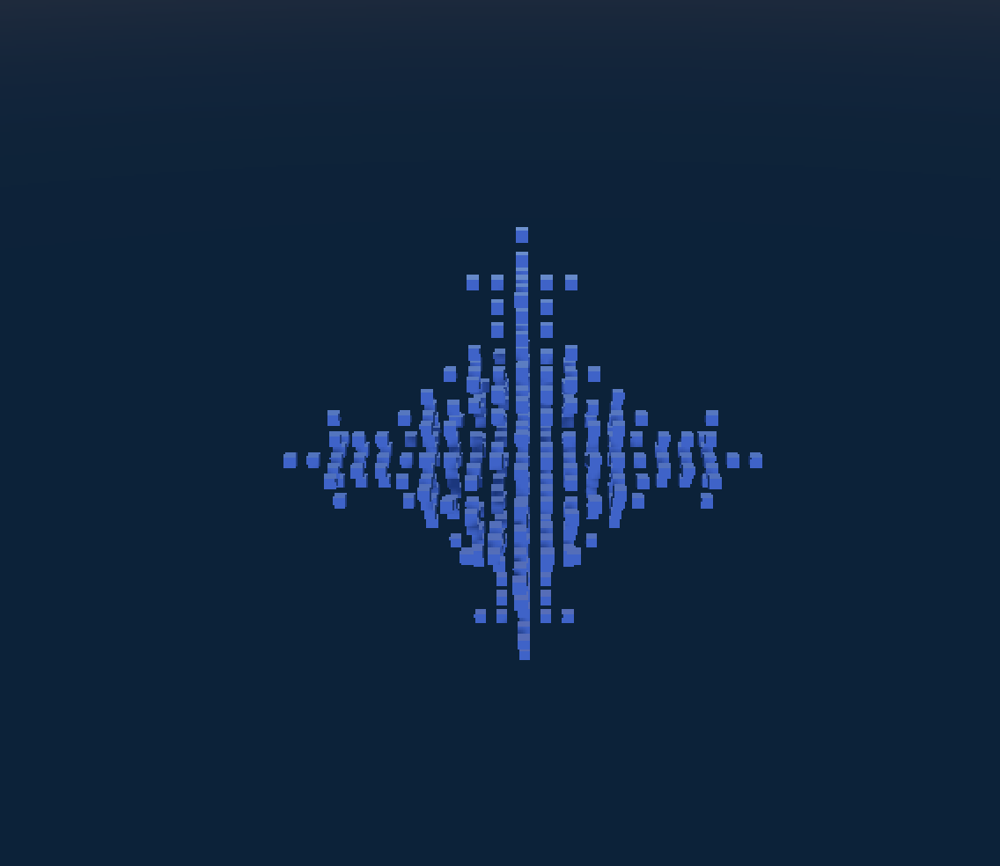
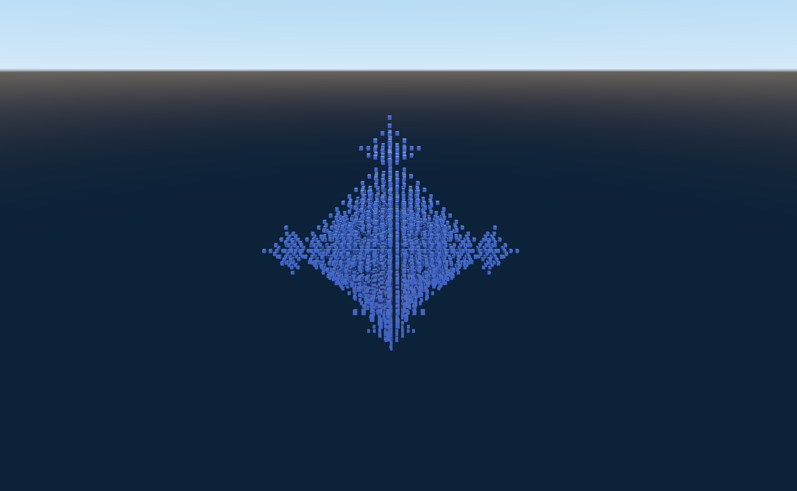
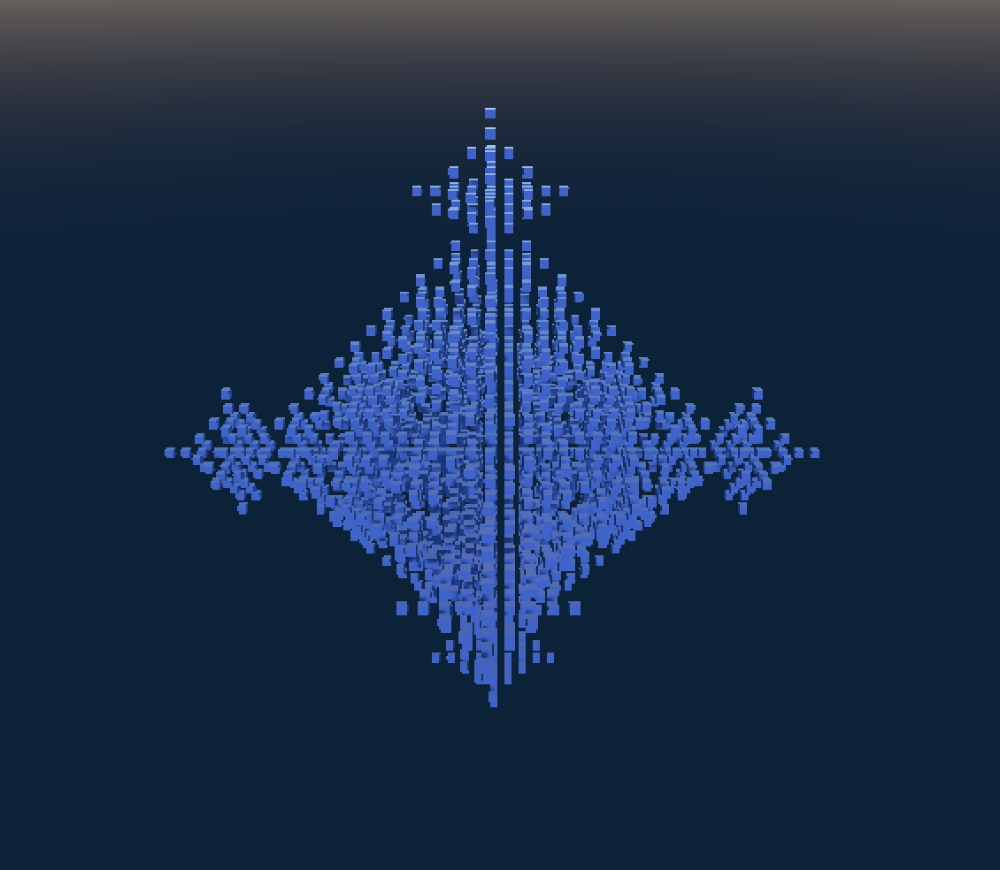
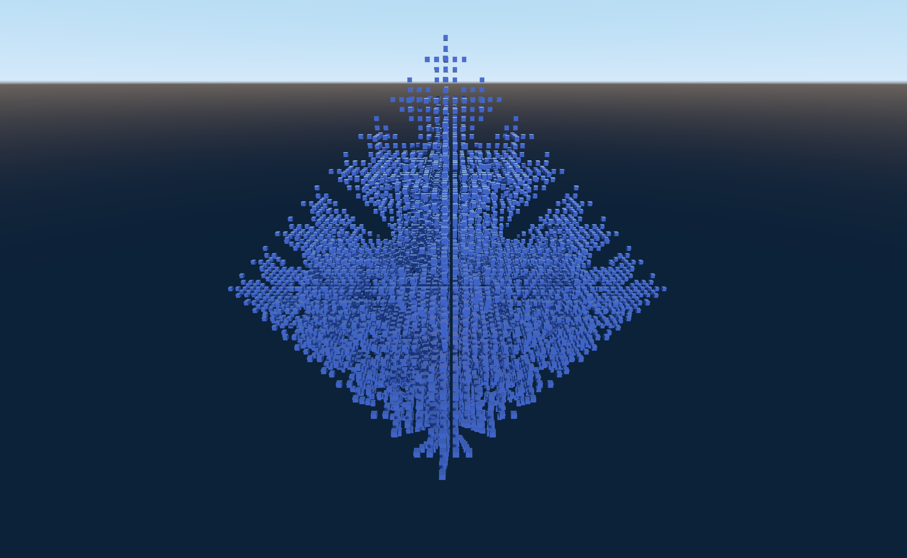
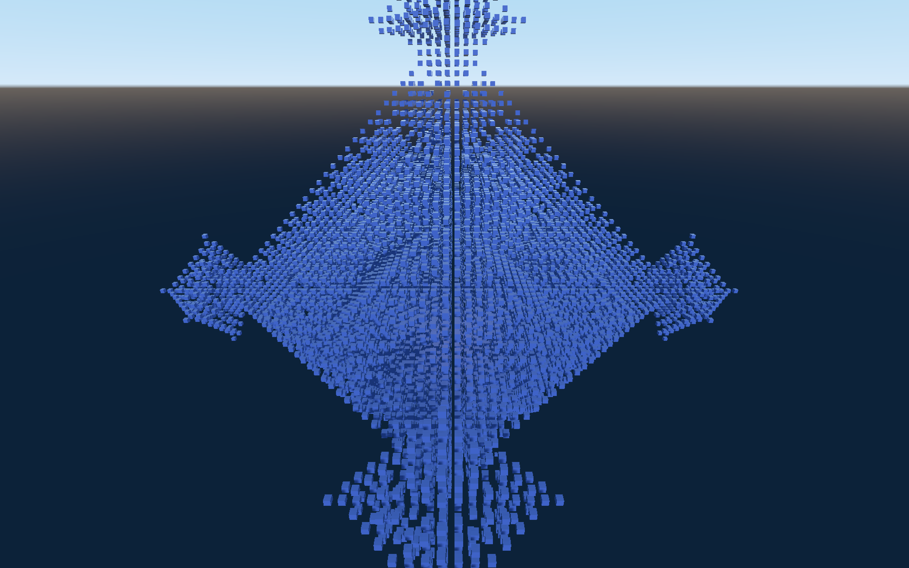
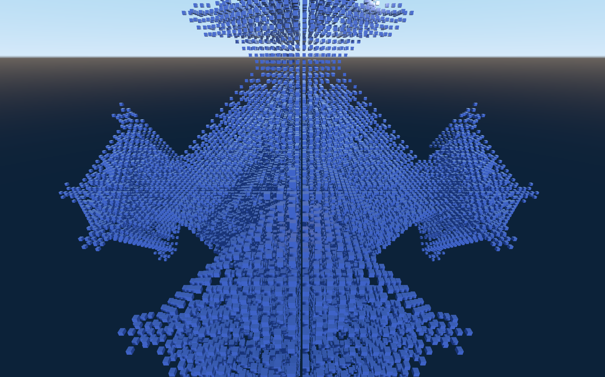
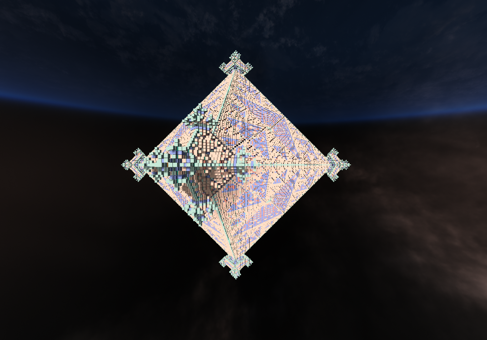
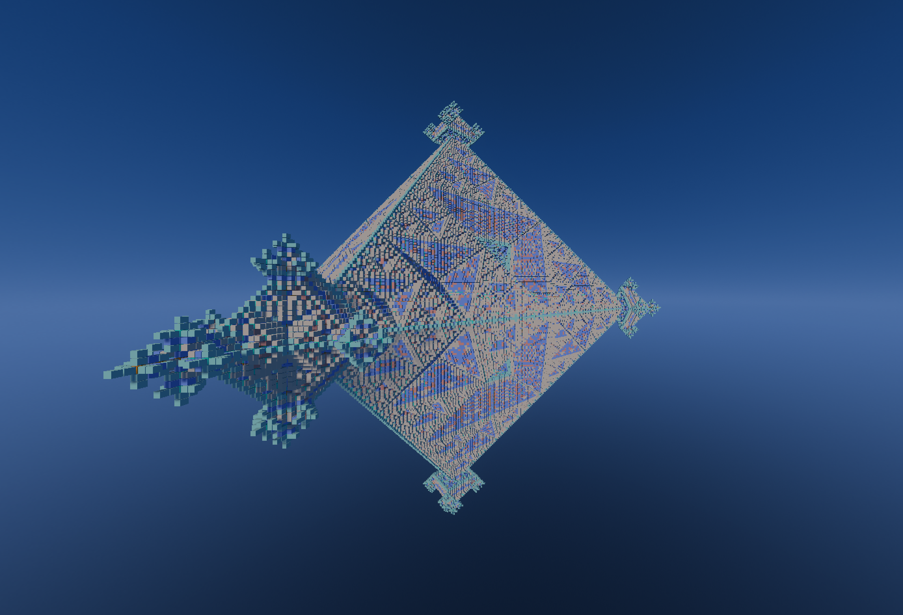
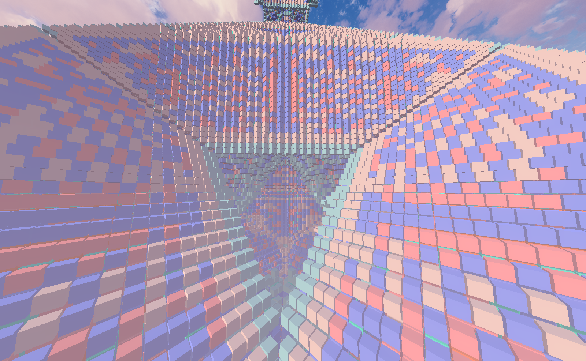
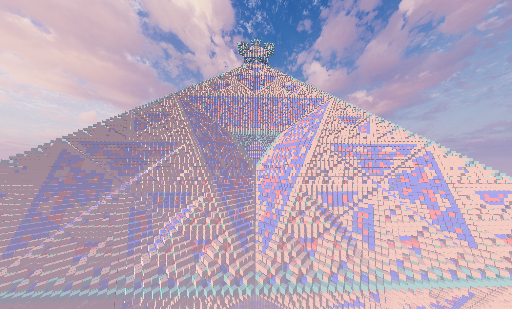

# MetaLife

#v 0.2

How to run at MacBook: 
1. Install .Net https://docs.microsoft.com/en-us/dotnet/core/install/macos
2. Install Visual Studio Code
3. Open the MetaLifeEngine folder in the Visual Studio Code
4. Open the Terminal Window (View -> Terminal)
5. Run "dotnet run" in the terminal

The next life form is generated according to the following rules:
1. An Alive cell would servive if it has 0-6 neighbours 
2. New cell would be created in an empty space if it has 1 or 3 neighbours 

Iterations 0 - 50:
ITERATION# 0 CELL COUNT: 1

ITERATION# 10 CELL COUNT: 397

ITERATION# 20 CELL COUNT: 2713

ITERATION# 40 CELL COUNT: 22585

ITERATION# 50 CELL COUNT: 36421

# More Runs

